# Real-Time Resume Scoring System

This repository contains the code for a **Real-Time Resume Scoring System** that processes resumes using Kafka, Spark Streaming, Flask, MongoDB, and Elasticsearch. The system allows companies to upload resumes, score them based on predefined criteria, and store the results in MongoDB and Elasticsearch for querying and analysis. Although Kibana was accessed, the integration with Elasticsearch for sending documents didn't work as expected.

**Note:** Due to some technical challenges, Elasticsearch integration is currently not working as intended, but the rest of the system functions as expected, including resume uploading, real-time processing, and storing data in MongoDB.

## Key Technologies

- **Kafka**: For streaming resume data to Spark in real-time.

- **Spark Streaming**: For processing the resumes and calculating scores.

- **Flask**: To provide an API for uploading resumes and interacting with the system.

- **MongoDB**: To store the uploaded resumes and their scores.

- **Elasticsearch/Kibana**: For indexing and querying the processed resumes and scores (integration currently not working as expected).


- **Docker**: For easy deployment and management of required services.
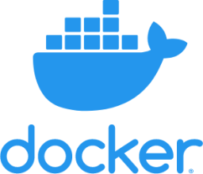

## Features

- **Resume Upload**: Upload resumes via an API endpoint.
- **Real-Time Processing**: Resumes are processed in real-time as they are uploaded using Kafka and Spark Streaming.
- **Resume Scoring**: Each resume is scored based on a predefined set of skills and work experience.
- **Data Storage**: Resumes and their scores are stored in MongoDB.
- **Searchable Data**: Attempted integration with Elasticsearch for storing processed data for easy querying and retrieval. Kibana is accessible, but Elasticsearch integration for storing documents is currently non-functional.

## Project Structure

The project is organized as follows:

resume_scoring_system/
│
├── src/
│   ├── producer/
│   │   ├── producer.py            # Code to produce (send) resume data to Kafka
│   ├── db/
│   │   ├── database.py            # Database interactions (MongoDB integration, etc.)
│   ├── streaming/
│   │   ├── spark_streaming.py     # Spark Streaming job for real-time resume processing
│   └── web/
│       ├── app.py                 # Flask application for uploading resumes and interacting with the system
│       ├── index.html             # HTML file for the web interface to upload resumes
│
├── assets/
│   └── images/                    # Folder to store images
│       ├── system_architecture.png
│       ├── resume_workflow.png
│       └── another_image.png
│
├── project_report.pdf         # PDF report for the project
│
├── venv/                          # Virtual environment for the project
│
├── .env                            # Contains environment variables for Kibana, Elasticsearch, and Kafka
├── docker-compose.yml              # Docker Compose file for Kafka, Elasticsearch, and Kibana containers
├── requirements.txt                # Python dependencies
├── README.md                       # Project documentation (this file)


## Setup and Installation

### Prerequisites

Before you start, make sure you have the following services installed and running:

- **MongoDB**: For storing resumes and their scores.
- **Kafka**: For streaming the resumes to the Spark Streaming job.
- **Elasticsearch**: For indexing and querying the processed resumes.
- **Docker**: To easily set up the services with Docker Compose.
- **MongoDB Compass (optional)**: For easy visualization and querying of the MongoDB database.

### Steps to Set Up

1. **Clone the Repository**:
   Clone the repository to your local machine:
```bash
   git clone https://github.com/inchirahjabir/resume_scoring_system.git
```

2. **Set Up a Virtual Environment**: 
Navigate to the project directory and create a virtual environment. 
```bash
    cd resume_scoring_system
    python3 -m venv venv
```

3. **Activate the Virtual Environment**: 
- On Mac:
```bash
    source venv/bin/activate

```
- On Windows:
```bash
    .\venv\Scripts\activate
```

4. **Install Dependencies**: 
Navigate to the project directory and install the required Python packages using:
```bash
    cd resume_scoring_system
    pip install -r requirements.txt
```
5. **Start MongoDB**: 
Run MongoDB using mongosh:
```bash
    mongosh
```
This will start MongoDB and allow you to interact with it via the command line. Optionally, you can use MongoDB Compass for better visualization of the databases and documents. 

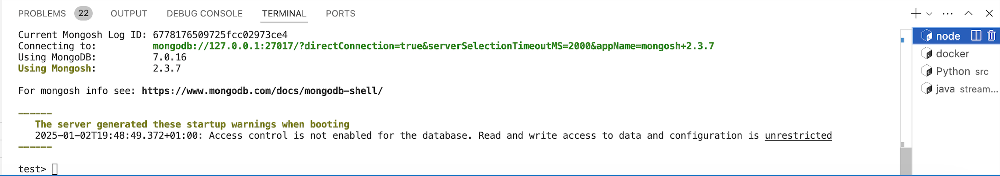

6. **Run the Services with Docker**: 
Ensure Docker is installed on your system and start the required services (Kafka, Elasticsearch, Kibana) using Docker Compose. Run the following command:
```bash
    docker-compose up
```
This will start the necessary containers for Kafka, Elasticsearch, and Kibana.

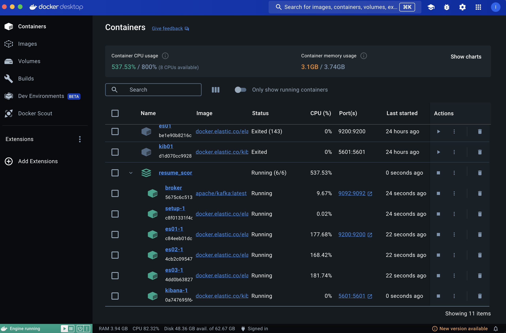

7. **Run Flask App**: 
Start the Flask application by running:
```bash
    python src/web/app.py
```
This will start a local web server at `http://127.0.0.1:5000`, where you can upload PDF resumes via the web interface.

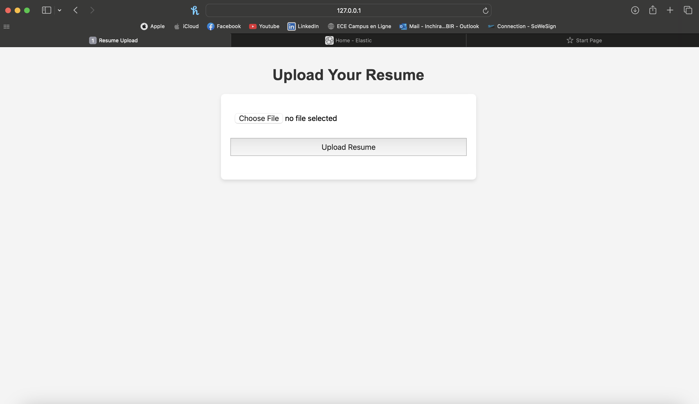

8. **Run Spark Streaming Job**: 
In a separate terminal, start the Spark Streaming job to process the incoming resumes:
```bash
    spark-submit \     --packages org.apache.spark:spark-sql-kafka-0-10_2.12:3.4.0 \     spark_streaming.py 
```

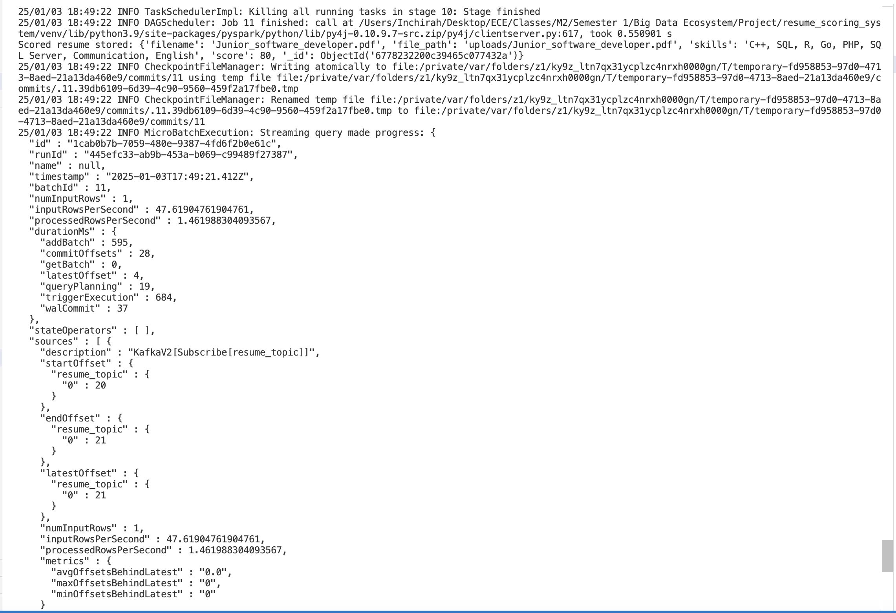

9. **Upload Resumes**: 
Once the Flask application is running, navigate to `http://127.0.0.1:5000` in your browser. You can upload PDF resumes using the web interface. The system will process the resume and store the results in MongoDB.

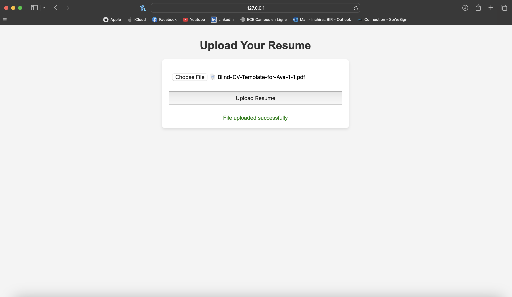

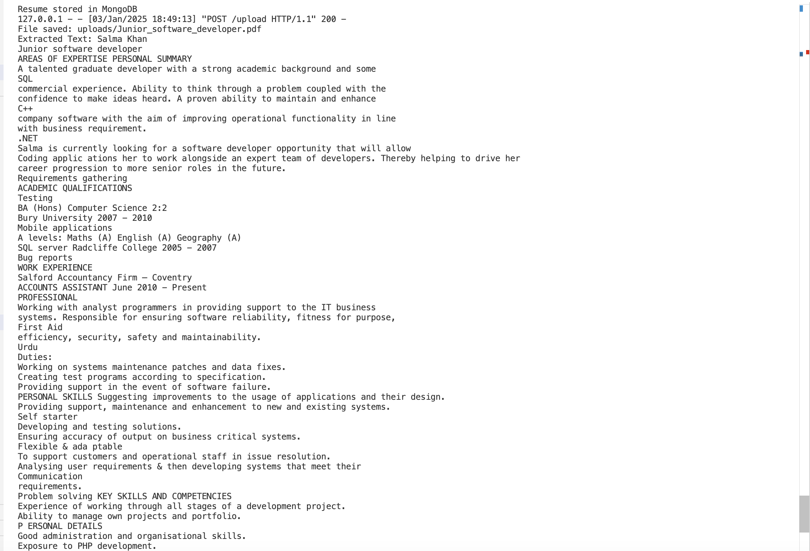

- Initial Resumes Stored on MongoDB Compass: 

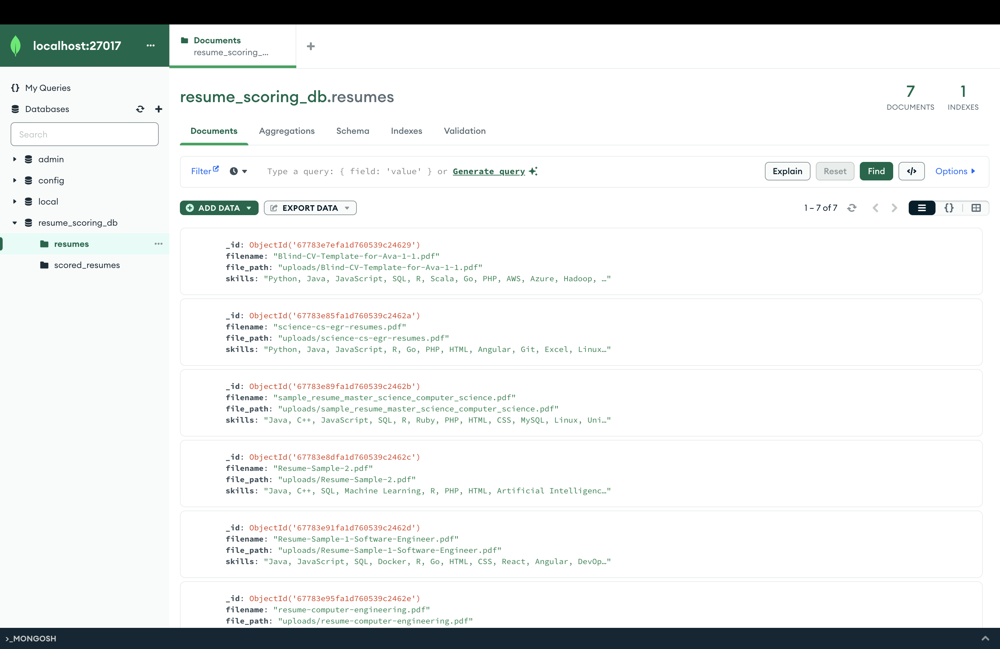


- Processed Resumes Stored on MongoDB Compass: 

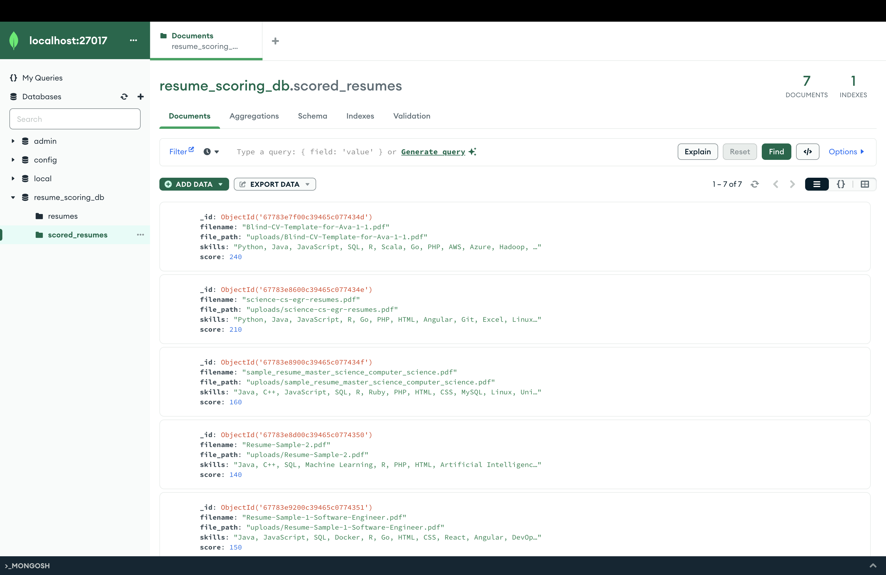

## Elasticsearch & Kibana Configuration

Kibana is accessible through `http://localhost:5601`, as specified in the .env file. However, the integration with Elasticsearch for storing documents is not functional at the moment. Despite our efforts using the MongoDB connector, Elasticsearch API keys, and other configurations, we were unable to send or view documents in Elasticsearch.

To access Kibana, use the username `elastic` and the password `ELASTIC123`, as set in the `.env` file.

We attempted to integrate Elasticsearch by scoring resumes and storing them both in MongoDB and Elasticsearch. However, despite these efforts, we were unable to see the documents in Elasticsearch, and the issue persists.

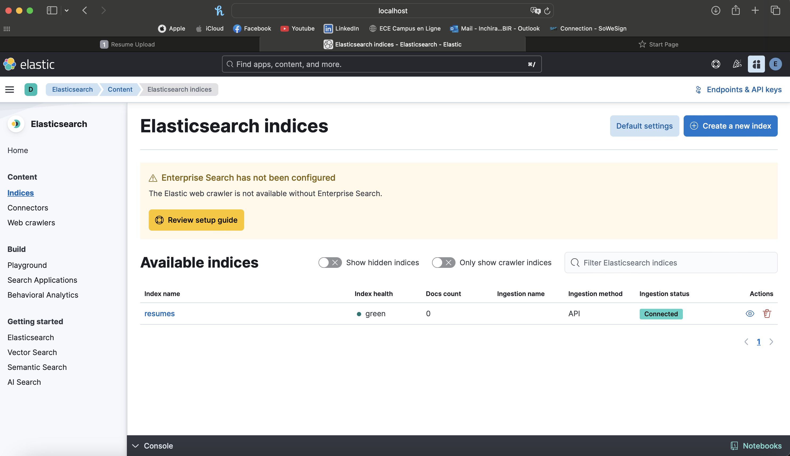

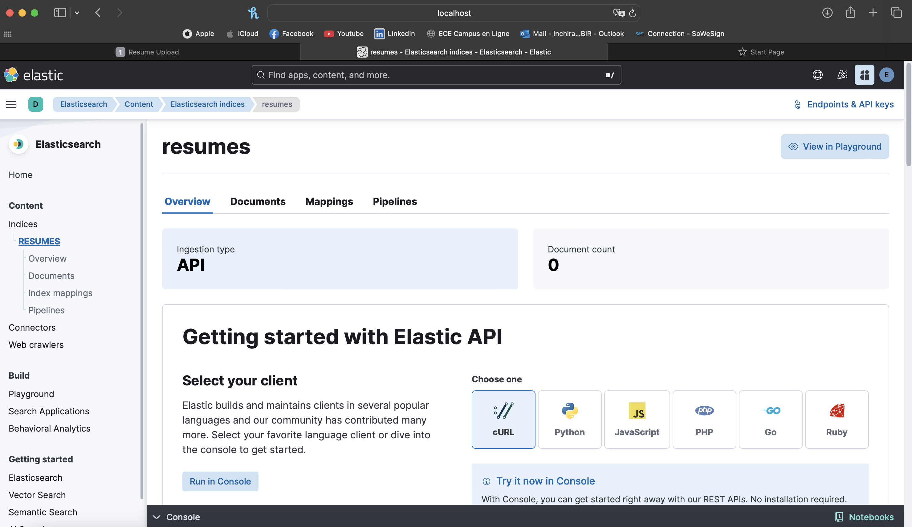

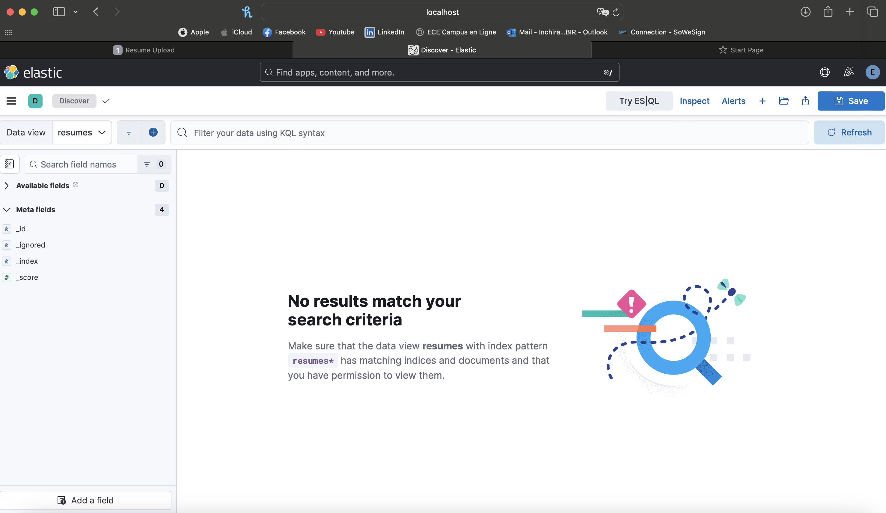

## Project Report

You can download the project report [here](reports/project_report.pdf).

## Conclusion

The Real-Time Resume Scoring System offers a solid solution for automatically scoring resumes in real time. It uses Kafka, Spark Streaming, Flask, MongoDB, and Elasticsearch to process resumes and store the results. While the system is working fine for resume uploads, real-time processing, and storing the data in MongoDB, the Elasticsearch integration isn’t functioning as expected. Despite trying different methods like using the MongoDB connector and Elasticsearch API keys, we couldn’t get the documents to show up in Elasticsearch.

Even though Elasticsearch is not fully working right now, the system still allows for processing and scoring resumes, and stores everything in MongoDB, where you can easily query and retrieve the data. There's still room to improve with Elasticsearch, but overall, the system is functioning well with its current features.

---

## Authors

- **Inchirah Jabir**, MSc 2 DMIA
- **Nouhaila Abouhachim Alami**, MSc 2 DMIA

